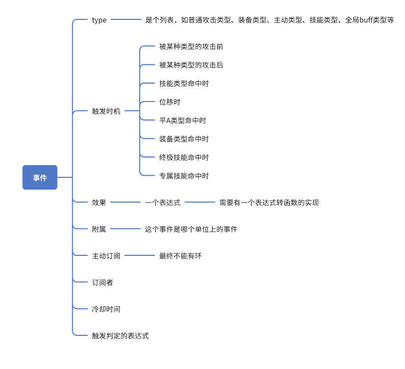

 事件驱动设计
## 1.设计背景
 想要高效快速的模拟计算出不同装备等等不同情况下的伤害情况，根据找到的资料来看，event bus的设计模式可以满足我们的需求。
## 2.模块设计
### 2.1 时间驱动设计
举例，A有普通攻击和1、2、3技共4个主动交互事件和一个被动技能，B有普通攻击一个主动交互事件，每个主动交互事件都有不同的冷却时间，在一开始时所有主动交互时间都会push进一个管理事件的队列里，这个队列的管理者每次都会取出时间最小的执行，一开始5个主动交互事件直接执行完了的同时，每个事件都能计算出自己的下一个执行事件然后调整在队列中的位置，然后管理者继续取出时间最小的执行，这样就不需要等待冷却了，我们可以快速模拟出A和B互相交互直到其中一方生命值为0。
### 2.2 事件的定义
从event bus的概念来看，event其实还是由上面的时间队列管理者来管理的。但是事件之间还有互相订阅的关系，需要缕清各种复杂的关系才能继续功能开发。
